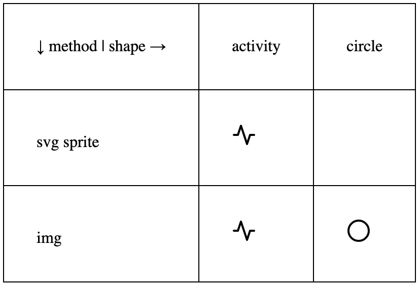
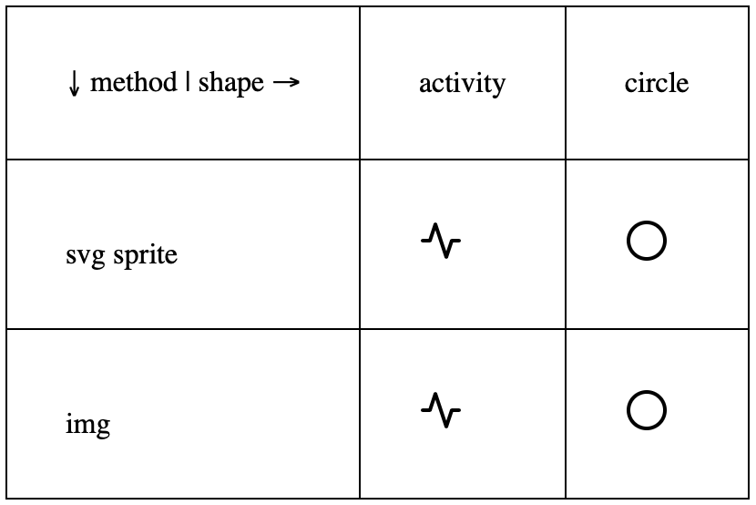

# svg-firefox-bug

Firefox doesn't display circle shape from a svg sprite in combination with [the-new-css-reset](https://github.com/elad2412/the-new-css-reset).

## Screenshots

Screenshot Firefox 93.0 on macOS 10.15.7

Screenshot Safari 15.0 on macOS 10.15.7

## Related

+ [codesandbox](https://codesandbox.io/s/reqrh)
+ [elad2412/the-new-css-reset/issues/11](https://github.com/elad2412/the-new-css-reset/issues/11)
